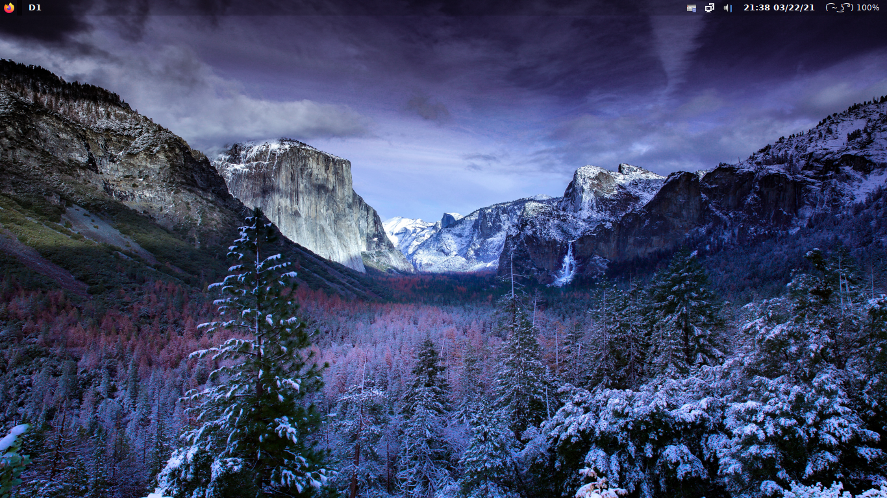
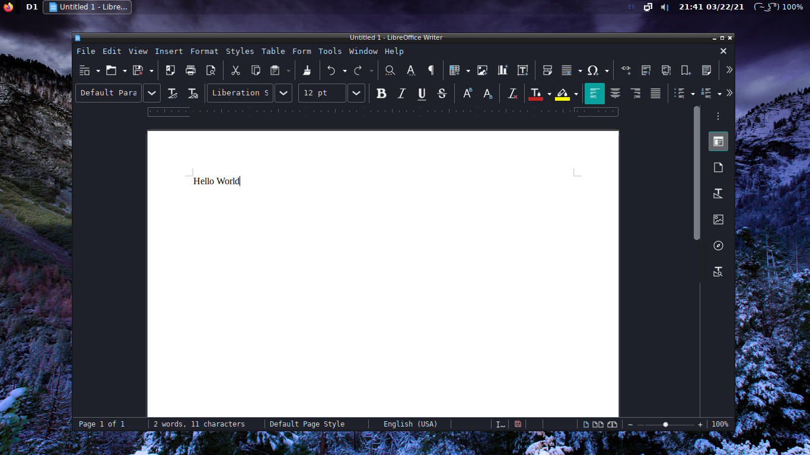

# archice

Lightweight Arch Linux rice with a window manager and base programs

# Screenshots

# How to use:

1. Install Arch Linux -> https://wiki.archlinux.org/index.php/Installation_guide (make sure to install NetworkManager or you will not be able to connect to the internet after restart)

        pacman -S networkmanager
        systemctl enable NetworkManager.service

2. Configure basic user with sudo privilages

    - Install sudo & visudo
        
            pacman -S sudo visudo

    - Make a new user

            useradd --create-home <username> -p <password>

    - Add user to the wheel group

            usermod --append --groups wheel <username>

    - Edit sudoers file using "visudo"

            Find the "%wheel ALL=(ALL) ALL" line and uncomment it.

    - Switch to new user
            
            su <username>

3. Install git

        sudo pacman -S git

4. Clone the repository

        git clone https://github.com/Bojidarist/archice.git
        cd archice

5. Run the install_base script

        ./install_base.sh

6. Enter the DE (configured in ~/.xinitrc)

        startx

# PulseEffects

https://wiki.archlinux.org/index.php/PulseAudio#PulseEffects

PulseEffects is a GTK advanced utility for applying several audio effects (e.g. Noise reduction, Equalizer etc.) to audio input and output. 

I decided to use pulseaudio and because the main version of PulseEffects only supports Pipewire now, we need to install the pulseeffects-legacy package from AUR.

To Install PulseEffects simply navigate to the archice directory and run the "install_pulseeffects.sh" script as user:

    ./install_pulseeffects.sh

# Shortcuts

Shortcuts can be configured in ~/.config/openbox/rc.xml

- **Terminal** - CTRL + ALT + T
- **Screenshot(to ~/Pictures)** - Print
- **Screenshot(to clipboard)** - Shift + Print
- **Screenshot(Selection/GUI)** - CTRL + Shift + Print
- **Synapse(Search/Open programs/Start menu)** - Super + Space
- **Thunar(File manager)** - Super + E

# Known Issues

- On first startup the sound may be muted by default. If that happens simply middle click on the sound tray icon to open the volume mixer (pavucontrol) and unmute your speakers.